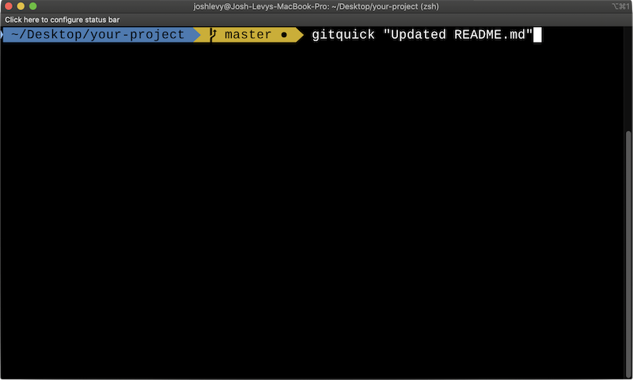

# gitquick - Git Add, Commit, and Push on the Fly

## TOC

- [Installation](#installation)
- [Usage](#usage)
- [New](#new)
- [Preview](#preview)
- [Features](#features)
- [Windows Users](#windows-users)

## Installation

`npm i -g gitquick`

## Usage

Inside your project directory, run the following in your terminal:

`gitquick "<your_commit_message>"`

gitquick automatically runs the following 3 commands:

`git add -A`, `git commit -m "<your_commit_message>"`, and `git push`

## New

**v2.x**: Added user-requested option to easily add and commit only (omitting push step)

Example:

`gitquick -c "<your_commit_message>"`

## Preview

### The Quickest and Easiest Way to Add, Commit, and Push

## Features

### Git Add, Commit, and Push With Only One Command

### Loading Spinners Indicate and Confirm Progress

### Clear, Tightly Grouped Success/Error Indication

### Error Handling That Keeps Your Console Clutter-Free

## Windows Users

**NOTE:** Currently, you need to use a terminal like [Git Bash](https://git-scm.com/downloads) to run gitquick. Support for Powershell coming soon.
